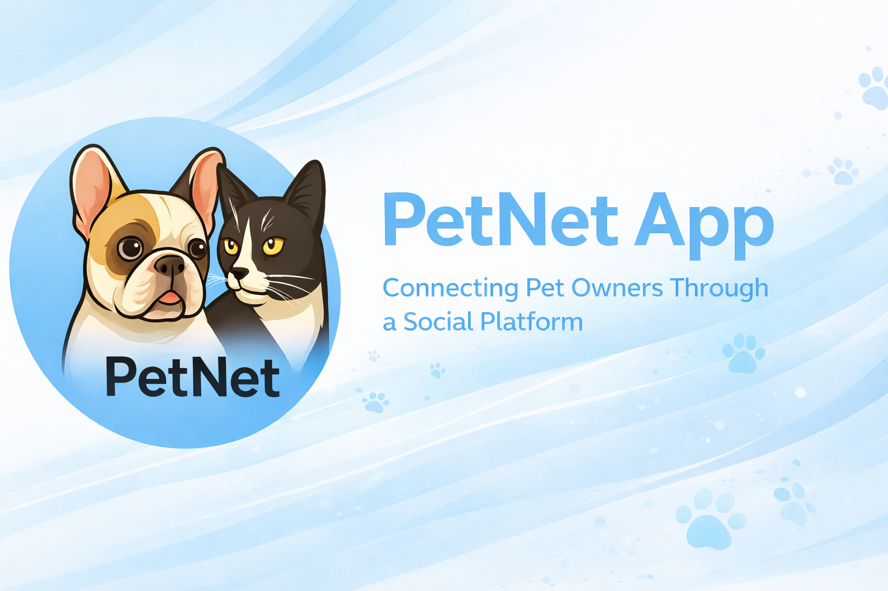
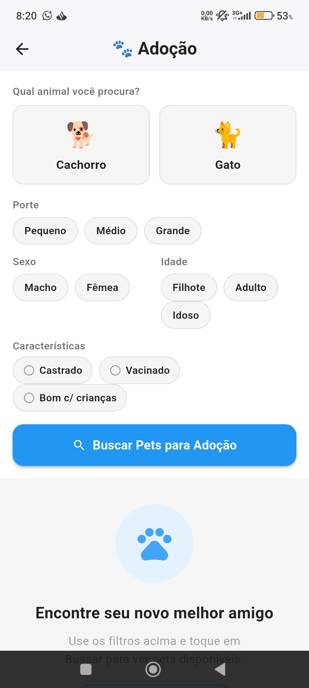
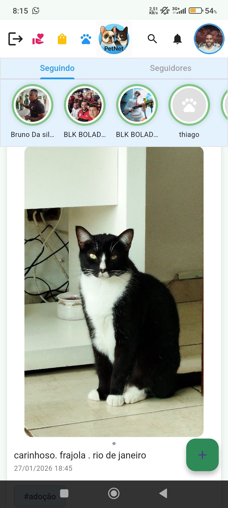
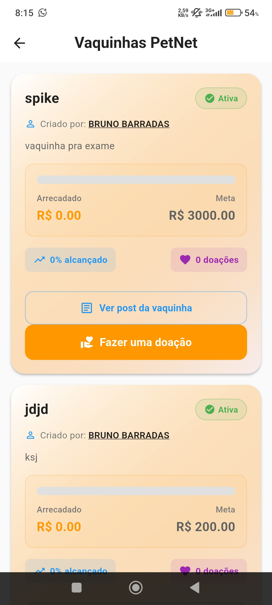

# PetNet App

## Overview
PetNet is a mobile application designed to connect pet owners through a social and community-driven platform.

The app brings together social interaction, content sharing, user engagement, and pet-related digital experiences in a single environment.

---

## Problem
Pet owners often lack a dedicated platform focused on community, interaction, and engagement around pets.

Most existing platforms are generic and do not provide a tailored experience for pet-related content, interaction, and services.

---

## Solution
PetNet provides a specialized social environment for pet owners, enabling:

- Community interaction
- Content sharing
- Engagement features
- Pet-focused digital experiences

---

## Key Features
- User profiles
- Social feed (timeline)
- Content sharing
- Community interaction
- Engagement features
- Donation-related features

---

## Product Vision
The goal of PetNet is to become a central platform for pet owners, combining social interaction, engagement, and useful services into one ecosystem.

---

## My Role
I worked on the development and evolution of the app, focusing on:

- Product structure
- Feature development
- User experience improvements
- Engagement strategy
- Mobile app implementation

---

## Tech Stack
- Flutter
- Firebase
- Mobile App Development
- UX-focused product design

---

## Notes
This repository is a portfolio overview of the project and does not include the private source code.

## App Screenshots

